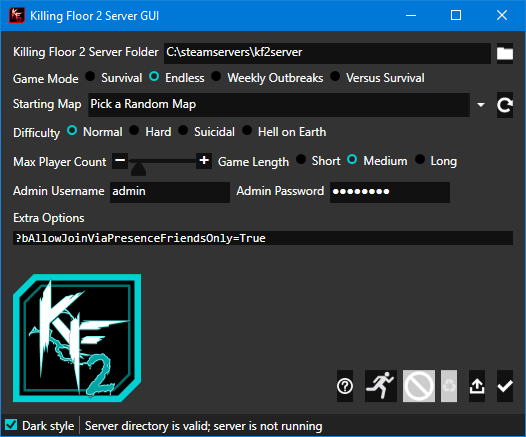
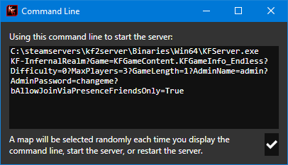
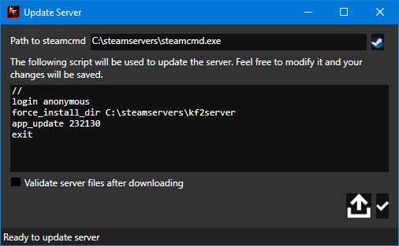

# kf2-server-gui

A simple GUI for configuring and running a Killing Floor 2 server. This is
primarily intended for casual players who like to host a server on their own
computer so their friends can play without messing with the command line or any
needlessly complicated configuration.

## Screenshots

The main window

The command line viewer

The server updater

## Prerequisites

You'll need to have a Killing Floor 2 server instance installed on your system.
You'll want to refer to the [Killing Floor 2
wiki](https://wiki.killingfloor2.com/index.php?title=Dedicated_Server_(Killing_Floor_2)#Downloading_the_Killing_Floor_2_Server)
for information on how to do that if you haven't set up a server already.

This is designed to work on 64-bit Windows systems with .NET Framework 4.7.2 or
newer. This would also work perfectly well on Linux if not for the fact that
the GUI is built with WPF and Mono doesn't support WPF.

## Installation

Just copy the build output anywhere you like on your system. The files don't
need to be in the same folder as your Killing Floor 2 server, though I find it
convenient to put them there.

## Starting the GUI

Run the kf2-server-gui.exe executable. This should open the main window.

### Configuration and Usage

The first thing you'll want to do is configure the path to your Killing Floor 2
server (the folder that contains the Binaries, Engine, KFGame, and steamapps
folders). After you've done that you can configure the server settings.

Mouse over various things for an explanation of what each setting does. I've
done my best to select some reasonable defaults that should allow you to start
hosting a server right away if you want to.

### Random Map Selection

One of my pet peeves is that there's no easy way to start the server with a
different map without updating the command line manually each time. This GUI
includes a "Pick a Random Map" option that will automatically select a random
map each time the server is started. Of course, you can also select any of the
maps available on the server instead.

Maps are populated based on the entries in the `KFGame\BrewedPC\Maps`folder in
your server installation instance.

### Extra Options

You can specify any additional options you'd like to be passed to the server.
These are simply appended to the command line.

### Viewing the Command Line

The GUI allows you to preview the command line that will be used to launch the
server so you can see what's happening under the hood and adjust your
configuration as desired.

### Starting, Stopping, and Restarting the Server

The GUI lets you start, stop, and restart the server. When the server is
started, it will run in its own window exactly as if you started it via the
command line. You can stop the server using any of three methods: using the
stop button in the GUI, pressing Ctrl-C in the server window (which is exactly
what the stop button does), or just closing the server window. I haven't
noticed any negative effects from any of these methods over any other.

The ability to restart the server is handy when you're making changes to the
configuration while you're playing. Of course, your players will probably need
to briefly disconnect from the server and then reconnect.

Restarting the server is identical to stopping and then starting the server.

### Updating the Server

Every so often Tripwire releases updates to Killing Floor 2. When this happens,
you may need to update the server so players can continue to connect to the
server. The GUI includes functionality to automate updating the server using
the steamcmd.exe tool (which you should already have if you have a Killing
Floor 2 server on the system). You can also customize the steamcmd script that
the GUI uses.

The first step to enabling the update functionality is to select the path to
the steamcmd.exe executable.

A default steamcmd script that ought to work in most instances is automatically
configured.

When you update the server, the steamcmd script is written to to
`update.script` in the same directory as the executable.

## Configuration File

The GUI uses a simple .ini file to store its configuration. The format of the
file is quite simple and it should be straightforward to edit by hand if so
desired. The .ini file is called `kf2-server-gui.ini` and is stored in the same
folder as the executable.

## Tips

These are really beyond the scope of the project, but I'm including them here
since I found them useful:

- Connect to your own instance of the server on your machine using `` `open 127.0.0.1`` in Killing Floor 2 (assuming you're playing on the same machine that you're hosting the server on).
- Set up port forwarding to allow your friends to join your server. I've found it easiest to have them use `` `open x.x.x.x`` to join instead of messing with Steam.
- Use [WhatIsMyIp.com](https://www.whatismyip.com/) or similar to figure out what your external IP address is.
- I haven't noticed any issues with people randomly connecting to the server, especially when running it only occasionally, so personally I'm not terribly concerned with using a secure admin password.

## License

This project is released to the public domain. Feel free to do with it as you
please. I hope you'll find it useful. See the [LICENSE](LICENSE) file for
details.
